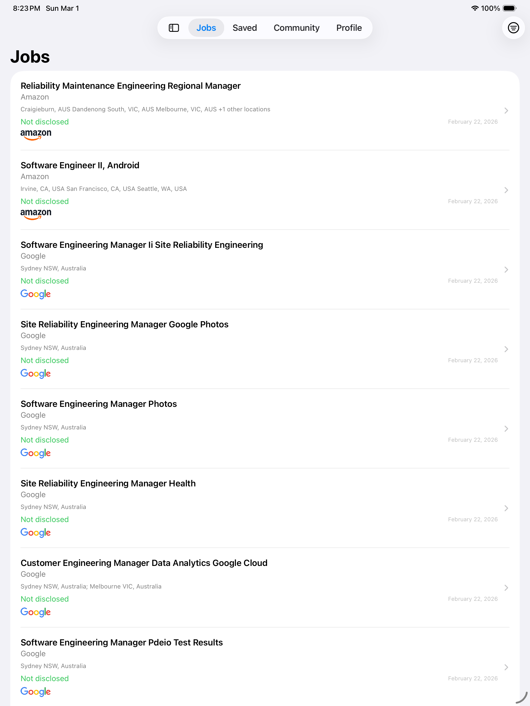
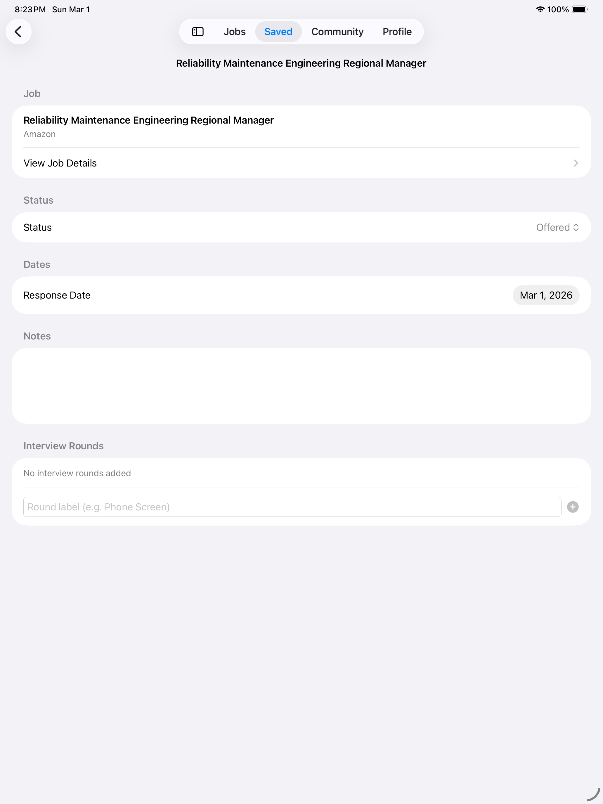
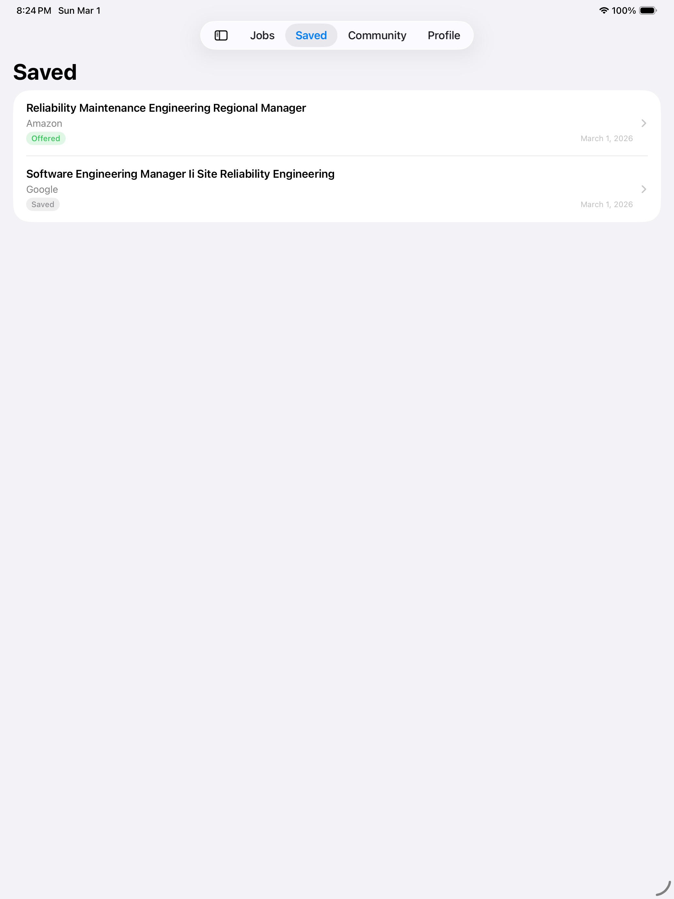
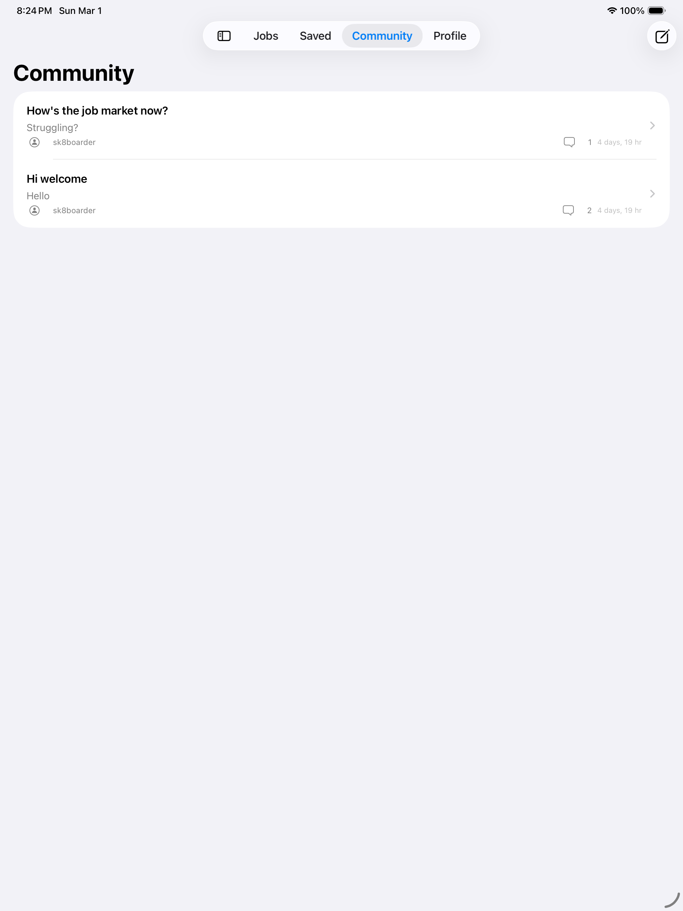
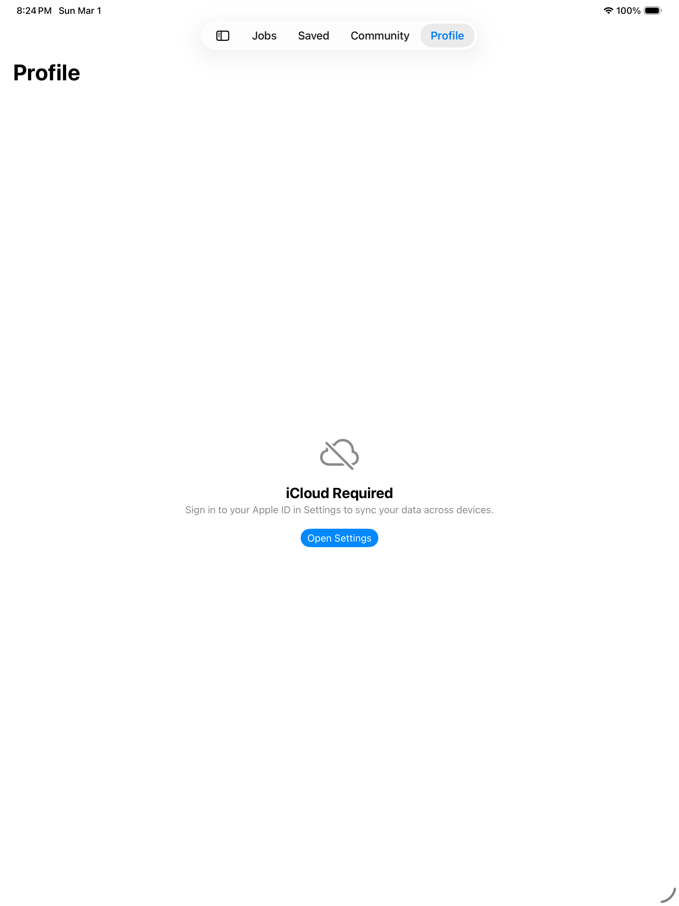

   

# DeviceDetector

Swift library for detecting Apple device models — iPhone, iPad, and device group classification.

Detects the current device model using hardware identifiers from the [Apple Wiki](https://theapplewiki.com/wiki/). Supports all models that can run iOS 13+, including iPhone 17, iPhone Air, and latest iPad generations.

## Features

- Detect current device model (iPhone, iPad, iPod) by name and type
- Classify devices into groups: screen size, product line, Safe Area (notch / Dynamic Island)
- Works on both physical devices and simulators
- 125+ device mappings maintained via `Device.plist`
- 38 unit tests

## Requirements

- Swift 5.6+
- iOS 13+

## Installation

### Swift Package Manager

Add to your `Package.swift`:

```swift
dependencies: [
    .package(url: "https://github.com/ShawnBaek/DeviceDetector.git", from: "1.0.0")
]
```

Or in Xcode: **File > Add Package Dependencies** and enter:

```
https://github.com/ShawnBaek/DeviceDetector.git
```

## Usage

### Basic Detection

```swift
import DeviceDetector

let detector = DeviceDetector.current
detector.deviceName   // "iPhone 15 Pro"
detector.isiPhone     // true
detector.isiPad       // false
detector.hasSafeArea  // true
```

### Device Groups

Uses `OptionSet` for flexible device group checks:

| Group | Includes |
|---|---|
| `iPhoneSet` | All iPhone models |
| `iPadSet` | All iPad models |
| `iPhoneSESet` | iPhone SE 1st, 2nd, 3rd generation |
| `iPhonePlusSet` | iPhone 6/7/8 Plus |
| `iPhoneSafeAreaSet` | All notch and Dynamic Island devices |
| `iPadProSet` | All iPad Pro models (9.7", 10.5", 11", 12.9", 13") |
| `iPhone4inchSet` | 4-inch screen devices |
| `iPhone4_7inchSet` | 4.7-inch screen devices |

```swift
import DeviceDetector

// Check specific device families
DeviceDetector.current.device.isSubset(of: .iPhoneSESet)      // SE 1st, 2nd, 3rd gen
DeviceDetector.current.device.isSubset(of: .iPadProSet)        // All iPad Pro models
DeviceDetector.current.device.isSubset(of: .iPhoneSafeAreaSet) // Notch & Dynamic Island
```

### Custom Identifier

```swift
let detector = DeviceDetector(id: "iPhone17,1")
detector?.deviceName  // "iPhone 16 Pro"
```

## Supported Devices

### iPhone
iPhone 6S / 6S Plus, iPhone 7 / 7 Plus, iPhone 8 / 8 Plus, iPhone X, iPhone XS / XS Max, iPhone XR, iPhone 11 / 11 Pro / 11 Pro Max, iPhone SE (1st–3rd gen), iPhone 12 mini / 12 / 12 Pro / 12 Pro Max, iPhone 13 mini / 13 / 13 Pro / 13 Pro Max, iPhone 14 / 14 Plus / 14 Pro / 14 Pro Max, iPhone 15 / 15 Plus / 15 Pro / 15 Pro Max, iPhone 16 / 16 Plus / 16 Pro / 16 Pro Max / 16e, iPhone 17 / 17 Pro / 17 Pro Max, iPhone Air

### iPad
iPad (5th–11th gen), iPad mini (4th–7th gen), iPad Air 2 / Air 3rd–5th gen / Air 11-inch & 13-inch (M2, M3), iPad Pro 9.7" / 10.5" / 11" (1st–5th gen) / 12.9" (1st–6th gen) / 13"

## Sample

### iPhone

|||||
|---|---|---|---|

### iPad

||||
|---|---|---|
||||
|---|---|---|

## License

MIT License.

## Author

Shawn Baek — [GitHub](https://github.com/ShawnBaek) · shawn@shawnbaek.com
